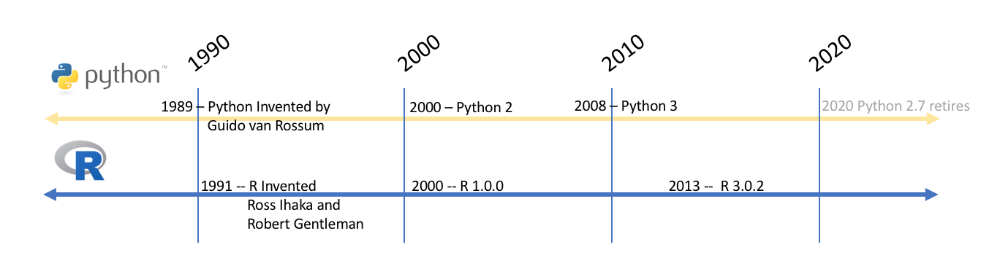

### 教學大綱
- #### [PART 1]. R的基本語法
- #### [PART 2]. Data ETL
- #### [PART 3]. 探索性資料分析及資料視覺化
- #### [PART 4]. 專案一: 婚姻品質是否會導致婚外情?
- #### [PART 5]. 專案二:我想買房子(房屋實價登錄資料集)




### [.設定所需的函式庫(libraries)以及載入資料]
```{r}
#if(!require(installr)) { install.packages("installr"); require(installr)} #load / install+load installr
 
#install.pandoc()
```


```{r message=FALSE, warning=FALSE, results='hide'}
rm()  #清除所有物件 
setwd("C:/My-Coding-zone/R/R-TKU") #設定工作區
getwd()  #查詢工作區
```


## [PART 1]. R的基本語法

### 1-1. Rmarkdown 文件的常用語法

### 1-1-1. 字型大小：
### R語言工作坊
#### R語言工作坊
##### R語言工作坊
###### R語言工作坊

### 1-1-2. 文句強調：
### *斜體* and **粗體**

### 1-1-3. 條列語句：

### 你覺得寫程式___:
- 令人開心
- 覺得沮喪
- 超不爽
- 輕鬆愉快

### 1-1-4. 表格：
第一組 | 第二組| 第三組| 第四組| 第五組
-------|-------|-------|-------|-------
樣本1  | 樣本2 | 樣本3 | 樣本4 | 樣本5
樣本6  | 樣本7 | 樣本8 | 樣本9 | 樣本10

### 1-1-5. 上下標：
- 單位：km^2^
- 二氧化碳: CO~2~

### 1-1-6. 分隔線：
***


### 我們採用內建的iris資料
  - 花萼長度(Sepal Length)
  - 花萼寬度(Sepal Width)
  - 花瓣長度(Petal Length)
  - 花瓣寬度(Petal Width)
  - 類別(Species)：可分為Setosa，Versicolor和Virginica三個品種。
  
  
  
```{r}
data(iris)
dim(iris) # 查看列數與欄數
```
```{r}
#看看IRIS資料集的頭尾
head(iris, 10) #取前10筆資料
tail(iris,10) #取後10筆資料
```

### 1-2.中央趨勢量數
```{r}
mean(iris$Sepal.Length)     #「花萼長度」的平均值
median(iris$Sepal.Length)   #「花萼長度」的中位數
max(iris$Sepal.Length)      #「花萼長度」中的最大值
min(iris$Sepal.Length)      #「花萼長度」中的最小值
sum(iris$Sepal.Length)      #「花萼長度」加總
```
```{r}
#類別資料算平均，得到NA不是夢
mean(iris$Species)
```
### 1-3.分散趨勢量數
```{r}
var(iris$Sepal.Length)      #「花萼長度」的變異數
sd(iris$Sepal.Length)       #「花萼長度」的標準差
range(iris$Sepal.Length)    #「花萼長度」最小值和最大值(全距)
```
```{r}
quantile(iris$Sepal.Length, probs=0.25)  # 第一四分位數 
quantile(iris$Sepal.Length, probs=0.75)  # 第三四分位數
```

### 1-4.一個一個key好累, 有沒有一個指令就可以搞定的
```{r}
summary(iris)
```
```{r}
#可是summary 指令有些東西沒有呈現, 還是要自己算
sd(iris$Sepal.Length)  #標準差
```


  
## [PART 2]. Data ETL
### 2-1.遺漏值處理
- 不管你是發問卷還是使用公司的資料集
- 你都有可能碰到"很雷" 的data-set
- 這時你必需處理missing data
- 在處理遺漏值時，大多數的人都會「直接移除資料」或是用「平均值來填補遺漏值」，但這樣的做法並不推薦：前者會讓資料減少，後者不會產生任何資訊。

- 因此在遺漏值處理的手法上，最推崇的就是「k-Nearest Neighbours」或「mice套件」來填補遺漏值。其中，mice的全名為Multivariate Imputation via Chained Equations。
```{r message=FALSE, warning=FALSE, results='hide'}
#我們先使用iris的資料集，讓資料中隨機產生遺漏值
#install.packages("missForest")
require(missForest) # prodNA() function
```

```{r}
data <- prodNA(iris, noNA = 0.1) ## 在iris資料內，隨機產生10%的遺漏值
head(data)
```

### 2-1-1.直接移除有遺漏值的資料
```{r}
# 當一筆資料是完整的，回傳TRUE；當一筆資料有遺漏值，回傳FALSE
complete.cases(data)
```
```{r}
# 移除有遺漏值的資料
rm.data <- data[complete.cases(data), ]
dim(rm.data) # 查看列數與欄數
rm.data
```

### 2-1-2. 用「平均數」來填補遺漏值
- 直接刪除遺漏值不太好，因為會造成資訊損失(information loss)。
- 所以我們常會採取「填補遺漏值」的手法
```{r}
mean.data <- data

mean.1 <- mean(mean.data[, 1], na.rm = T)  # 取第一欄位的平均數
na.rows <- is.na(mean.data[, 1])           # 第一欄位中，有遺漏值存在的資料

mean.data[na.rows, 1] <- mean.1 # 用第一欄位的平均數，填補第一欄位的遺漏值
```

```{r}
# 當一筆資料是完整的，回傳TRUE；當一筆資料有遺漏值，回傳FALSE
complete.cases(mean.data$Sepal.Length) #看一下還有沒有遺漏值
```

### 2-2.重新編碼
- 分析資料前常常需要再次整理資料，方便日後做分析，整理資料第一步往往是將資料的調整值經過一些調整
```{r message=FALSE, warning=FALSE, results='hide'}
library(dplyr)

```
```{r}
data <- iris # 使用 R 內建的資料
head(data)
```
```{r}
data$Sepal.Length <- ifelse(data$Sepal.Length > 5, 1,2) # Sepal.Length 如果大於 5 會變成 1，不會就會變成 2
data$Species <- ifelse(data$Species %in% "setosa", "IsSetosa","Notsetosa") # %in% 代表有包含到的概念

head(data)
```

### 2-3.資料篩選 分割
### 2-3-1.資料篩選
```{r}
data (iris)# 使用 R 內建的資料。
```
```{r}
iris[1:3,] ##第1~3列Row，所有的行Column
iris[,"Species"] ##所有的列Row，名稱為Species的行Column
```
```{r}
iris[1:10,c(T,F,T,F,T)] ##第1~10列Row，第1,3,5行Column (TRUE)
```
```{r}
# Row的篩選可使用subset()函數
subset(iris,Species=="virginica") ##Species等於"virginica"的列Row，所有的行Column
```


### 2-3-2.資料分割
- 使用subset()函式進行資料分割
```{r}
subset(iris, Sepal.Length > 7) # 只會出現 Sepal.Length > 7 的資料
```
```{r}
subset(iris, Sepal.Length == 5,select = c("Sepal.Length","Species")) # 只會出現 Sepal.Length 等於 5 的資料，且欄位只會出現 Sepal.Length 和 Species
```
```{r}
subset(iris, Sepal.Length > 7,select = - Sepal.Length) # selct = 負的代表不要出現的欄位
```

### 2-4.排序

```{r}
order(iris$Sepal.Length)#由小排到大

#回傳的第一個位置為14，表示iris$Sepal.Length中，數值最小的元素為第14個元素。
```

```{r}
iris$Sepal.Length[14]
```
```{r}
head(iris[order(iris$Sepal.Length),]) ##依照Sepal.Length欄位數值大小排序後的前六筆資料
```
```{r}
#若將decreasing參數設定為TRUE，則會回傳由大到小的元素位置，
#以iris$Sepal.Length為例，回傳的第一個位置為132

order(iris$Sepal.Length,decreasing = T)

#表示iris$Sepal.Length中，數值最大的元素為第132個元素。

```
```{r}
iris$Sepal.Length[132]
```
```{r}
head(iris[order(iris$Sepal.Length,decreasing = T),]) ##改為由大到小排序的前六筆資料
```
### 2-5.資料組合: cbird 和 rbind的應用
### 2-5-1.rbind的應用
```{r}
irisAdd<-rbind(iris, #資料框
      c(1,1,1,1,"versicolor")  #在最尾巴新增一列
      ) 

tail(irisAdd)
```
### 2-5-2.cbind的應用
```{r}
irisAdd<-cbind(iris, #資料框
      rep("Add",nrow(iris))  #新增一行
      ) 

tail(irisAdd)
```

## [PART 3]. 探索性資料分析及資料視覺化

```{r message=FALSE, warning=FALSE, results='hide'}
#install.packages("ggplot2")
rm()  #清除所有物件 
library(graphics)
library(ggplot2)

```
```{r}
data(iris)
head(iris)
```

### 3-1. 基本敘述性統計
```{r}
class(iris)
summary(iris)
```

### 3-1-1. 相關分析
```{r}
#install.packages("ggcorrplot")
library(ggplot2)
library(ggcorrplot)
```
```{r}
iris2=iris[,1:4]
```


### 3-2.ggplot2基本圖形
- 哪些内容（aes）
- 哪種圖形（geom_ 指定圖形）
- 數據轉換（stat）
- 圖形位置（position）


### 3-2-1.散佈圖(scatter plot)
```{r}
ggplot(data=iris,aes(x=Sepal.Width, y=Sepal.Length)) + geom_point() + theme_minimal()
```
```{r}
ggplot(data=iris,aes(x=Sepal.Width, y=Sepal.Length,color=Species)) + geom_point() + theme_minimal()#以Species為類別換顏色
```
```{r}
ggplot(data=iris,aes(x=Sepal.Width, y=Sepal.Length,color=Species)) + geom_point() +geom_smooth() + theme_minimal() #加上趨勢線geom_smooth()
```
```{r}
ggplot(data=iris,aes(x=Sepal.Width, y=Sepal.Length,color=Species)) +
geom_point() + geom_smooth(se=FALSE) +facet_wrap(~Species) +theme_minimal()#把三種類別分開畫
```
```{r}
ggplot(data=iris,aes(x=Sepal.Width, y=Sepal.Length,color=Species)) +
geom_point() + geom_smooth(se=FALSE) +facet_wrap(~Species,scale='free_y') +theme_minimal()#分開畫之後，可以給予Free_y
```
### 3-2-2.箱型圖(Box-Plot)
```{r}
options(repr.plot.width = 5, repr.plot.height = 4)#調整圖形大小

ggplot(data=iris,aes(x=Species, y=Petal.Length,color=Species)) + geom_boxplot() +theme_minimal()+
theme(legend.position="none")
```
```{r}
box <- ggplot(data=iris, aes(x=Species, y=Sepal.Length))
box + geom_boxplot(aes(fill=Species)) + 
  ylab("Sepal Length") + ggtitle("Iris Boxplot") +
  stat_summary(fun.y=mean, geom="point", shape=5, size=4) 
```


### 3-2-3.小提琴圖(Violin Plot)
- 小提琴圖(Violin plot)和箱形圖(boxplot)很類似
- 箱形圖的方形可以顯示出Q1、Q3兩個4分位數，小提琴圖則可以強化資料分佈密度(Density)來展示圖形
```{r}
vol <- ggplot(data=iris, aes(x = Sepal.Length))
vol + stat_density(aes(ymax = ..density..,  ymin = -..density.., 
                       fill = Species, color = Species), 
                   geom = "ribbon", position = "identity") +
  facet_grid(. ~ Species) + coord_flip() + xlab("Sepal Length") 
```


```{r}
ggplot(data=iris,aes(x=Species, y=Petal.Length,color=Species)) + geom_violin() +theme_minimal()+
theme(legend.position="none")
```

```{r}
#把箱型圖跟小提琴圖疊起來

p <- ggplot(data=iris, aes(x=Species, y=Petal.Length,color=Species)) #指派一個底圖

p + geom_violin() + geom_boxplot(width=.1, fill="black", outlier.colour=NA) + 
stat_summary(fun.y=median, geom="point", fill="white", shape=21, size=2.5)
 
```
### 3-2-4.直方圖(histogram)
```{r}
ggplot(data=iris,aes(x=Sepal.Length)) + geom_histogram() +theme_minimal() #直方圖的分箱數（bins）使用了30 個每30單位為一區隔預設值
```


```{r}
#如果我調整binwidth
ggplot(data=iris,aes(x=Sepal.Length)) + geom_histogram(binwidth=0.25) +theme_minimal()
```
```{r}
ggplot(data=iris,aes(x=Sepal.Length,fill=Species)) + geom_histogram() +theme_minimal() +facet_wrap(~Species)#facet_wrap()，會把圖由左往右，由上往下排出來
```
### 3-2-5.長條圖(Bar-plot)
- stat = "summary" 裡面的功能有：fun.data, fun.y, fun.ymax (設最大值), fun.ymin (設最小值)

```{r}
ggplot(data=iris,aes(x=Species,y=Petal.Length,color=Species)) + geom_bar(stat = "summary", fun.y = "mean") +
theme_minimal()
```

```{r}
ggplot(data=iris,aes(x=Species,y=Petal.Length,color=Species)) + geom_bar(stat = "summary", fun.y = "mean") + coord_flip()
```

### 3-2-6.圓餅圖(Pie Chart)
- 要用ggplot2畫圓餅圖，要先畫出bar plot，再沿著y軸進行轉軸
```{r}
 ggplot(iris, aes(x = "", y = Petal.Length, fill = Species)) + 
            geom_bar(width = 1, stat="identity") + 
            coord_polar("y", start=0 ) + ggtitle("Pie Chart") 
```


### 3-2-7.密度圖(density)
```{r}
density <- ggplot(data=iris, aes(x=Sepal.Width))
density + geom_histogram(binwidth=0.2, color="black", fill="steelblue", aes(y=..density..)) +
  geom_density(stat="density", alpha=I(0.2), fill="blue") +
  xlab("Sepal Width") +  ylab("Density") + ggtitle("Histogram & Density Curve")
```


```{r}
ggplot(data=iris,aes(x=Petal.Width,y=Petal.Length,color=Species)) +geom_density2d()+ theme_minimal()
```


### 資料分佈矩陣圖
```{r message=FALSE, warning=FALSE, results='hide'}
#install.packages("GGally")
library(GGally)

```
```{r }
ggpairs(iris)
```

## [PART 4]. 專案一: 婚姻品質是否會導致婚外情?
- 原始論文(A Theory of Extramarital Affairs ) https://fairmodel.econ.yale.edu/rayfair/pdf/1978a200.pdf

- rate_marriage   : How rate marriage, 
  - 1 = very poor, 
  - 2 = poor, 
  - 3 = fair, 
  - 4 = good, 
  - 5 = very good
  
- age             : Age

- yrs_married     : No. years married. Interval approximations. See original paper for detailed explanation.
- children        : No. children

- religious       : How relgious, 
  - 1 = not, 
  - 2 = mildly, 
  - 3 = fairly, 
  - 4 = strongly
  
- educ            : Level of education, 
  - 9 = grade school, 
  - 12 = high school, 
  - 14 = some college, 
  - 16 = college graduate,
  - 17 = some graduate school, 
  - 20 = advanced degree
  
- occupation      : 
  - 1 = student, 
  - 2 = farming, agriculture; semi-skilled,or unskilled worker; 
  - 3 = white-colloar; 
  - 4 = teacher counselor social worker, nurse; artist, writers; technician, skilled worker, 
  - 5 = managerial, administrative, business, 
  - 6 = professional with advanced degree
  
- occupation_husb : Husband's occupation. Same as occupation.
- affairs         : measure of time spent in extramarital affairs

### 4-1.資料讀入與清理
```{r message=FALSE, warning=FALSE, results='hide'}
library(ggplot2)
library(ggcorrplot)
```


```{r}
fair = read.csv("./data/fair.csv", header=T, sep=",", encoding = "BIG5")#Mac的同學請採用UTF8的檔
class(fair)
dim(fair)
str(fair)
```

```{r}
#資料轉換
fair$occupation <- factor(fair$occupation) #職業為類別變數
fair$occupation_husb <- factor(fair$occupation_husb)#老公的職業為類別變數
fair$religious <- factor(fair$religious)#宗教的虔誠度為類別變數
```

```{r}
str(fair)
```

### 4-2.敘述性統計
```{r}
#看一下前後六筆
head(fair)
tail(fair)
```
```{r}
summary(fair) #基本統計資料
```
```{r}
library(dplyr)

summarise(group_by(fair, educ), 婚外情平均=mean(affairs)) #分組資料 group_by的使用，教育程度跟婚外情的比例
summarise(group_by(fair, occupation), 婚外情平均=mean(affairs)) #分組資料 group_by的使用，職業跟婚外情的比例
```
```{r}
ggplot(data=fair,aes(x=occupation,y=affairs,color=occupation)) + geom_bar(stat = "summary", fun.y = "mean") + coord_flip()
```

### 4-3.相關與ANOVA
- https://rpubs.com/skydome20/R-Note5-First_Practice

### 4-3-1.相關分析
- 因原始資料集中有類別型的資料，因此需要將數值型資料取出
```{r}
#
fair1<-fair[,c("rate_marriage","age","yrs_married","children","educ","affairs" )]
head(fair1)
```
```{r}
corr<-cor(fair1)
corr
ggcorrplot(corr, lab = TRUE, type = "lower", method="circle")
```


### 4-3-2.ANOVA
- #### 我們可以看出，不同職業組別在婚外情比例上有差異
```{r}
agg1 = aggregate(fair[,c("age","yrs_married","rate_marriage","affairs")],by=list(fair$occupation),FUN=mean)
agg1
```

- #### 我們可以看出，不同宗教信仰強度在婚外情比例上有差異
```{r}
agg2 = aggregate(fair[,c("age","yrs_married","rate_marriage","affairs")],by=list(fair$religious),FUN=mean)
agg2
```
#### - H0: 不同職業的婚外情平均數相等
#### - H1: 至少有一種職業的婚外情平均和其他職業不相等
```{r}
aov<-aov(fair$affairs~as.character(fair$occupation)) #ANOVA
summary(aov)

```
```{r}
#進行事後檢定(採用Tukey )
TukeyHSD(aov)
```
### [小結]: 在alpha=0.05下，我們有顯著的證據支持
- (4-3) 專業工作者與一般白領階級在婚外情平均上有顯著差異
- (6-4) 高階專業人士與專業工作者在婚外情平均上有顯著差異

### [課堂作業]. H0: 不同宗教的虔誠度(religious)的婚外情平均數相等
```{}


```

### 4-4.迴歸分析
- 婚外情到底受到那些因素影響

### 4-4-1.複迴歸分析
```{r}
model <- lm(formula= affairs ~ ., data=fair1)
summary(model)
```
### [小結]. 在alpha=0.05下，我們有顯著的證據支持，婚姻品質(rate_marriage)對婚外情有負向的影響

### 4-4-2.模型診斷(迴歸基本假設分析)


```{r}
#理論上我們應該採用以下
#shapiro.test(model$residual)#用來檢驗殘差的常態性
#虛無假設H0:殘差服從常態分配，因為p-value > 0.05，代表不會拒絕H0

#但因為shapiro.test 設定sample size <5000，不適合此例，因此我們採用QQ-Plot

#install.packages("ggfortify")
library(ggfortify)

autoplot(model)
```
### Q-Q plot 圖中會加入一條常態直線圖，當 Q-Q plot 散佈圖在此直線附近時，代表樣本資料來自常態分佈
```{r message=FALSE, warning=FALSE, results='hide'}
require(car)
```

```{r}
durbinWatsonTest(model)#檢驗殘差的獨立性
#虛無假設H0:殘差間相互獨立，因為p-value < 0.05，代表拒絕H0
#殘差獨立性檢定的 p-value 也非常小，所以也拒絕虛無假設，亦即殘差值的獨立性假設是不合理的。
```
```{r}
ncvTest(model)#殘差的變異數同質性
#虛無假設H0:殘差變異數具有同質性，因為p-value < 0.05，代表拒絕H0。(這表示上面的線性模型無法使用)
#殘差的變異數沒有符合同質性的假設
```

## [PART 5]. 專案二:我想買房子(房屋實價登錄資料集)
### **[說明]**
- #### 資料內容：登記日期自 108年7月11 至 108年7月20日之買賣案件
- #### 原始資料刪除:
  - 交易標的: 土地、車位
  - 建物型態: 工廠、其他、倉庫、農舍、廠辦、辦公商業大樓
  - 交易與建築年月不符
- #### 屋齡小於一年的以中位數0.5計

- #### 房屋型態定義
  - 華廈(10層含以下有電梯)、
  - 套房(1房1廳1衛)、
  - 公寓(5樓含以下無電梯)、
  - 大樓(11層含以上有電梯)

```{r}
Data = read.csv("./data/housesale.csv", header=T, sep=",",encoding = "BIG5")#Mac的同學請採用UTF8的檔
dim(Data)
str(Data)
```

```{r}
#看一下前後六筆
head(Data)
tail(Data)
```

### 5-1. 敘述性統計
- 目前的變數有21 個，我們把需要的變數取出來就好，版面會比較乾淨
- 我預計要取: **行政區、縣市、鄉鎮市、屋齡、型態、面積坪數、管理、房價、車位**
```{r}
dat1<-Data[,c("行政區","縣市","鄉鎮市","屋齡","型態","面積坪數","管理","房價","車位" )]

dat1[sample(1:nrow(dat1),6),] #隨機抓六筆出來看
```

```{r}
summary(dat1) #基本統計資料
```

### Q:如果我想知道不同房屋型態平均來說多少錢?
```{r}
# pivotal table
library(dplyr)
summarise(group_by(dat1, 型態), 平均=mean(房價)) #分組資料 group_by的使用
```

### Q: 各縣市在不同型態的房屋數量
```{r}
table1=table(dat1$"縣市", dat1$"型態") #卡方列聯表
table1
```

### 5-2. 資料視覺化
- 我們採用ggplot2套件
```{r}
library(ggplot2)
```

```{r}
count <- sort(table(dat1$"縣市"),decreasing=TRUE)[1:10] #各縣市的數量排序(遞減) ，取前10個縣市
zone <- factor(names(count),levels=names(count),ordered=TRUE) #把lable 放上去
df <- data.frame(count, zone)
df

g <- ggplot(data=df, aes(x=zone,y=count,fill=zone)) + 
  geom_bar(colour="black",stat="identity") + 
  guides(fill=FALSE)

g

# g + theme_gray(base_family="STHeiti") # 顯示中文字 Mac user only
```


### 5-3.Data Mining: Decision Tree
- 回到一開始的問題: **我想買房子**
- 為了教學方便，同時減少城鄉誤差造成的差距，我們只取**"臺北市"、"新北市"、"基隆市"、"桃園市"**


```{r}
library(dplyr)#dplyr是對資料做整理的套件
library(ggplot2)#ggplot2 是劃圖套件
library(rpart)# rpart 是決策樹套件
library(rpart.plot)# rpart.plot是決策樹的繪圖套件
```
### 5-3-1.決策樹
```{r}
dat2 <- dat1[dat1$縣市 %in% c("臺北市","新北市","基隆市","桃園市") ,]
nrow(dat2)
```

```{r}
head(dat2)
dat2[sample(1:nrow(dat2),10),] #隨機抓10筆出來看
```


```{r}
boxplot(面積坪數~型態,data=subset(dat2,縣市=="臺北市"),ylab="面積坪數",main="面積")
```


### 還記得我們的問題嗎? (我想買房子)
- 所以問題是:*我該買在哪裡*?
- #### 縣市~型態+面積坪數+屋齡+房價

```{r}
dat2$房價百萬 <- dat2$房價/10^6 

boxplot(房價百萬~型態,data=subset(dat2,縣市=="臺北市"),ylab="房價百萬",main="房價")
```


```{r}
fit2 <- rpart(縣市~型態+面積坪數+屋齡+房價百萬,data=dat2)
prp(fit2,col=2,box.col="lightgray",shadow.col="gray")
```

### 5-3-2.預測正確率
```{r}
result = rpart(縣市~型態+面積坪數+屋齡+房價百萬, data=dat2)
Y = dat2$縣市
Ypred = predict(result, type="class")

t = table(Y, Ypred)   # 同時顯示 t 的內容
cat("預測正確率 = ", sum(diag(t))/sum(t), "\n" )
```
### 5-5-3. 稀疏矩陣
```{r}
confmatrix = function(Y,Ypred)
{
  
  tab = table(Y,Ypredict=Ypred)  
  print(tab)
  p = sum(diag(t))/sum(t)*100
  cat("\n\n預測正確率 = ",p,"% \n")
}

confmatrix(dat2$縣市, Ypred)
```


### [課堂作業]. 請你挑選你喜歡的1-3個城市，做出決策樹
```{}


```

## [附件補充資料A]. 房屋實價登錄Regression
### A-1.Regression
```{r}
plot(dat1$面積坪數,dat1$房價/10^4,xlab="面積(坪)",ylab="房價(萬元)")
plot(dat1$面積坪數,dat1$房價/10^4,xlab="log面積(坪)",ylab="log房價(萬元)",log="xy") #因為有一個坪數超高的，所以取log
```


```{r}
cor(dat1$"面積坪數",dat1$"房價"/10^4) #相關係數
```

### A-1-1. Simple Regression
```{r}
x <- dat1$面積坪數
y <- dat1$房價/10^4

plot(x,y,xlab="面積(坪)",ylab="房價(萬元)")
fit <- lm(y~x)
abline(fit,col=2,lwd=2)
```
```{r}
summary(fit) # 迴歸係數
```

### 如果只看台北市呢
```{r}
dat3 <- dat1[dat1$縣市=="臺北市",]
x <- dat3$面積坪數
y <- dat3$房價/10^4
plot(x,y,xlab="面積(坪)",ylab="房價(萬元)"); fit<-lm(y~ x)
abline(fit,col=2)
legend("topleft",legend=round(summary(fit)$r.squared,4),title="r.squared")

summary(fit) 
```

### A-1-2.Multiple regression 

```{r}
m12 <- lm(房價~面積坪數+屋齡+型態+車位+管理, data=dat1) #全國的資料
summary(m12)
```

### A-1-3. 比較模型
- 我們採用台北市的資料來建立預測模型
- 以避免因城鄉差距所造成的誤差
```{r}
dat3 <- dat1[dat1$縣市 %in% "臺北市",] #只挑選台北市的資料集
m22 <- lm(房價~面積坪數+屋齡+型態+車位+管理, data=dat3)
summary(m22) 
```
```{r}
data.frame("model.taiwan.all"=summary(m12)$r.sq, 
           "model.taipei.all"=summary(m22)$r.sq) #比較兩個模型的R-Square
```

### A-2. 回歸預測模型
- 用台北市的資料，來預測房價
- 所以要將台北市的資料及分成**訓練資料**及**測試資料**

```{r}
# 先把資料區分成 train=0.8, test=0.2 
set.seed(22)
train.index <- sample(x=1:nrow(dat3), size=ceiling(0.8*nrow(dat3) ))

trainingData = dat3[train.index, ]
testData = dat3[-train.index, ]
```
```{r}
# 使用訓練及資料建置模型 & 使用測試集資料預測結果
mod <- lm(房價~面積坪數+屋齡+型態+車位+管理, data=trainingData, na.action = na.omit)
predictY <- predict(object = mod, newdata = testData)

summary(mod)
```

```{r}
#檢視模型預測的效果。
actuals_predicts <- data.frame(cbind(actuals = testData$房價, predicteds = predictY))

#計算真實數據與預測數據的相關係數：越高越好。
cor(actuals_predicts,use="complete.obs") 
cor(actuals_predicts,use="pairwise.complete.obs") 
```

```{r}
#計算AIC, BIC => 越低越好。
AIC(mod)
BIC(mod)

```
```{r}
#計算模型預測正確率min_max_accuracy
min_max_accuracy <- mean(apply(actuals_predicts, 1, min) / apply(actuals_predicts, 1, max))
min_max_accuracy

```

```{r}
#計算模型預測錯誤率 MAPE (Mean absolute percentage error)
mape <- mean(abs((actuals_predicts$predicteds - actuals_predicts$actuals))/actuals_predicts$actuals)
mape
```


### 資料來源
- http://whizzalan.github.io/R-tutorial_DataAnalysis/index.html#1
- 

